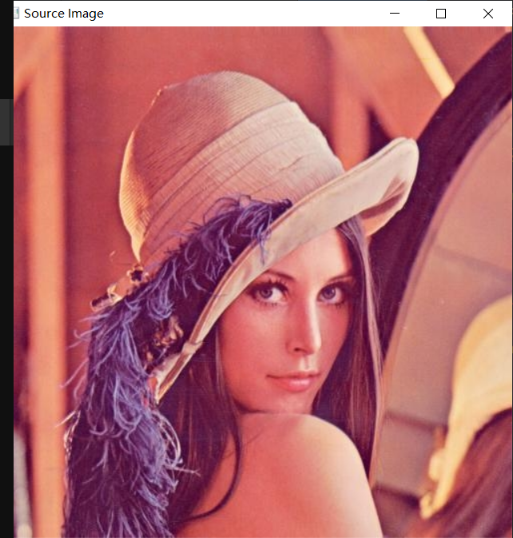
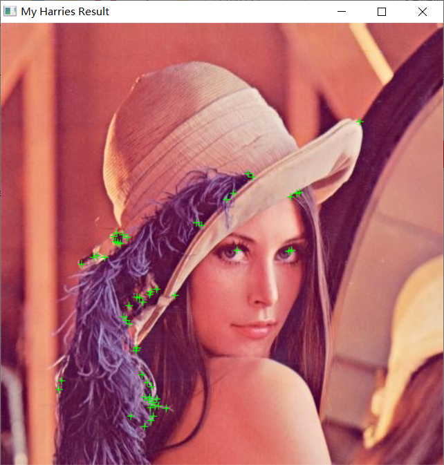
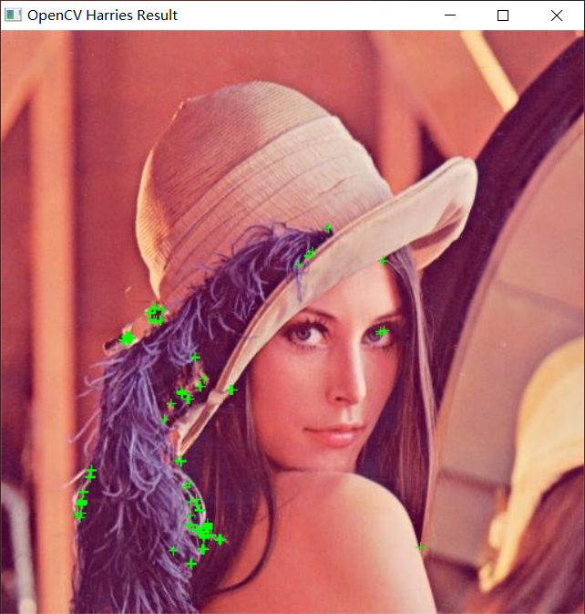
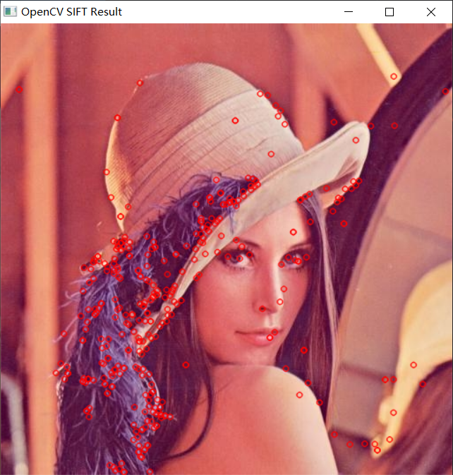

## Computer Vision Assignment2

### 题目要求

利用课上学习的Harris角点检测和SIFT特征检测对图像进行处理

具体要求包括:

1. 输入一张图像
2. 检测图像的Harris角点特征，并用绿色”+”标记
3. 检测图像的SIFT特征，并用红色”o”标记

提交内容：

+ a. 源码
  + 两种方法均使用opencv函数（60分)
  + —种使用opencv函数，一种自行编码（100分)
+ b. 报告
  + 包含实验结果分析和运行结果截图。原图加2、3效果图。Pdf文件（10分)

### 完成情况

1. 分别使用 OpenCV 函数和自行编码的方式实现了Harris角点检测
2. 使用 OpenCV 函数检测图像的 SIFT 特征

### Usage

使用 `CMake`完成编译，推荐在Linux系统下运行，在Windows下运行需要提前配置好相应环境变量，如CMake、Make、编译好的OpenCV、OpenCV_DIR等。

本项目使用的OpenCV版本为 OpenCV 4.5.3

+ 编译

  ```bash
  mkdir build
  cd build
  cmake ..
  make
  ```

  如果是在Windows系统下，则需使用如下指令：

  ```bash
  mkdir build
  cd build
  cmake .. -G "Unix Makefiles"
  make
  ```

+ 运行两种算法，包括自行编写的 Harris、OpenCV 实现的 Harris 角点检测和 OpenCV 实现的 SIFT 特征检测

  ```bash
  ./main.exe
  ```

### 效果展示

#### 原图



#### Harris 角点检测结果（自行编码实现，阈值130）



#### Harris 角点检测结果（OpenCV函数实现，阈值130）



#### SIFT 特征检测结果


