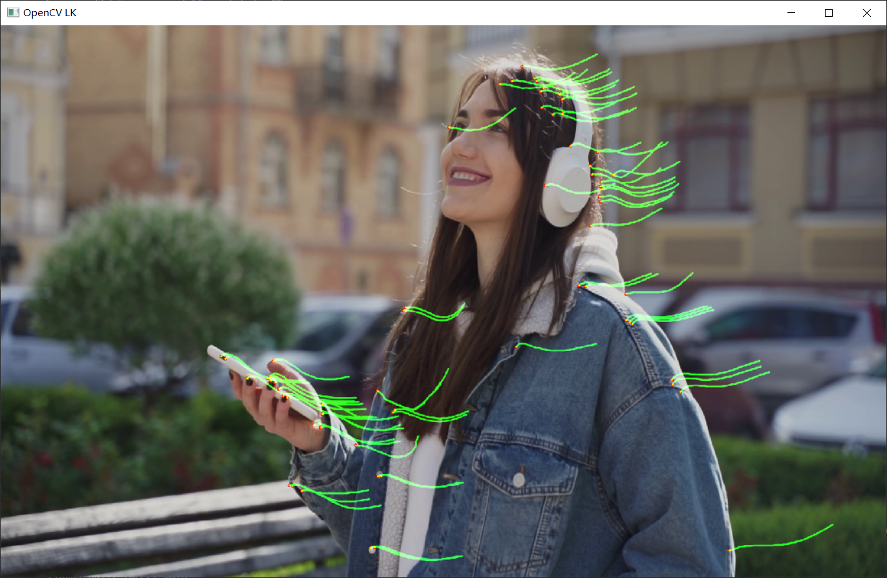
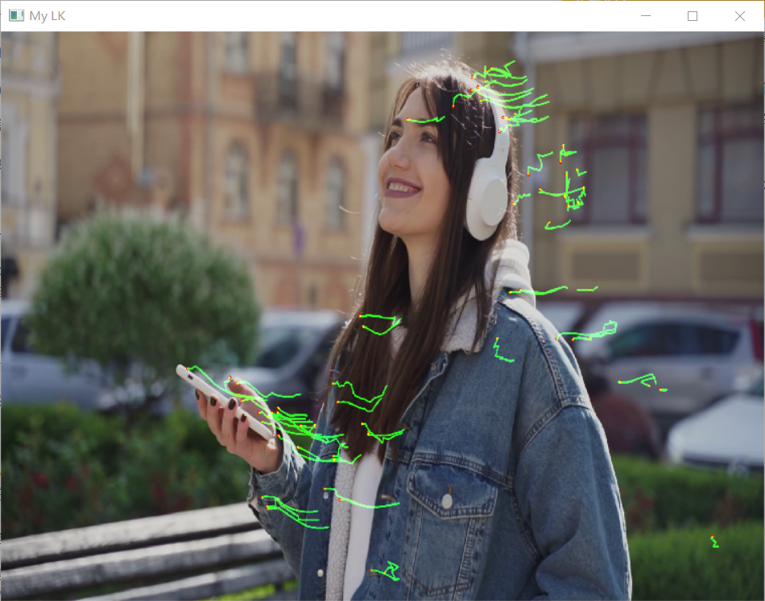

## Assignment3 Lucas Kanade  光流计算

### 题目要求

利用课上学习的Lucas Kanade方法计算稀疏光流

具体要求包括：

1. 加载一段视频。
2. 检测其中的特征点，使用Lucas-Kanade光流迭代跟踪这些点，并绘制线段。

提交内容:

+ a.源码。
  + 使用Opencv库函数完成(2)(75分)
  + 自行实现LS光流计算(90分)
  + 使用c++,提交cpp文件。
+ b.报告。
  + 包含实验结果分析及运行结果截图。
  + 原视频截图+光流示意图。
  + Pdf文件，10分

### 完成情况

1. 使用了 OpenCV 库函数 cv::calcOpticalFlowPyrLK 完成了光流跟踪
2. 自行编码实现了基于金字塔的 LK 光流计算
   + 运行速度有些慢
   + 效果不是很好，设置了一个光流速度最大阈值才勉强能用

### Usage

使用 `CMake`完成编译，推荐在Linux系统下运行，在Windows下运行需要提前配置好相应环境变量，如CMake、Make、编译好的OpenCV、OpenCV_DIR等。

本项目使用的OpenCV版本为 OpenCV 4.5.3

+ 编译

  ```bash
  mkdir build
  cd build
  cmake ..
  make
  ```

  如果是在Windows系统下，则需使用如下指令：

  ```bash
  mkdir build
  cd build
  cmake .. -G "Unix Makefiles"
  make
  ```
+ OpenCV 库函数实现方式运行

  ```bash
  ./main.exe opencv
  ```
+ 自行编码实现方式运行

  ```bash
   ./main.exe my
  ```

### 效果展示

#### 原视频截图


#### OpenCV 实现光流算法截图



#### 自行编码实现算法截图


