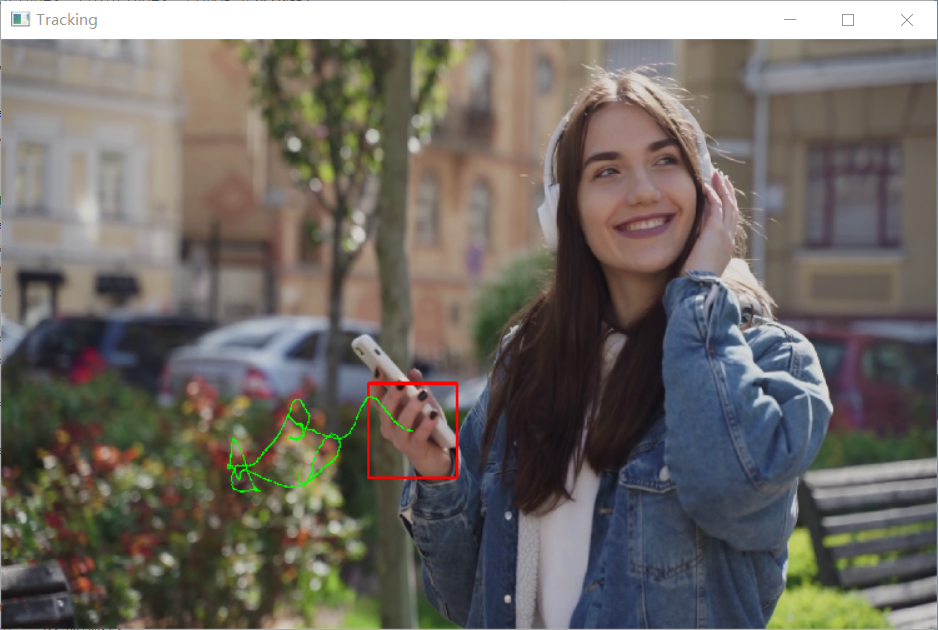
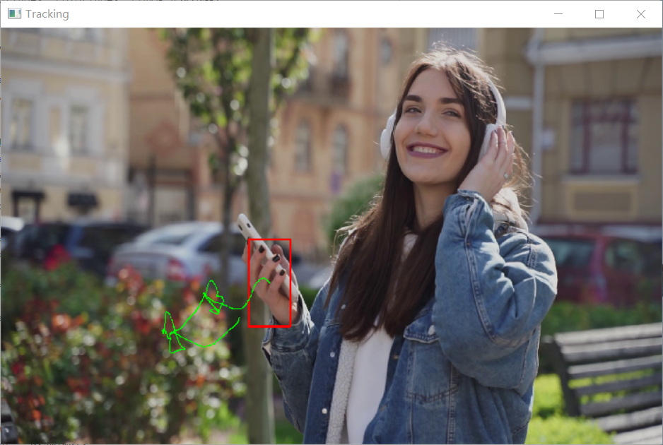

## QUIZ：Meanshift与CamShift目标跟踪

### Tasks

+ 输入一段短视频
+ 使用cv::meanshift，选择其中的一个物体并进行跟踪;
+ 使用cv::Camshift，选择其中的一个物体并进行跟踪
+ 比较两种方法的异同
+ bonus: camshift如何实现动态改变搜索框大小的?

### 提交要求

+ 两种方法目标跟踪的录屏(.mp4)(60分)
+ 并在实验报告中给出截图及关键原理解释与分析(40分)
+ 回答出bonus部分额外给20分

### Usage


使用 `CMake`完成编译，推荐在Linux系统下运行，在Windows下运行需要提前配置好相应环境变量，如CMake、Make、编译好的OpenCV、OpenCV_DIR等。

本项目使用的OpenCV版本为 OpenCV 4.5.3

+ 编译

  ```bash
  mkdir build
  cd build
  cmake ..
  make
  ```

  如果是在Windows系统下，则需使用如下指令：

  ```bash
  mkdir build
  cd build
  cmake .. -G "Unix Makefiles"
  make
  ```
+ 运行 cv::meanShift

    ```bash
    ./main.exe mean
    ```

+ 运行 cv::camShift

    ```bash
    ./main.exe cam
    ```

### 部分效果截图
#### MeanShift 效果截图



#### CamShift 效果截图


